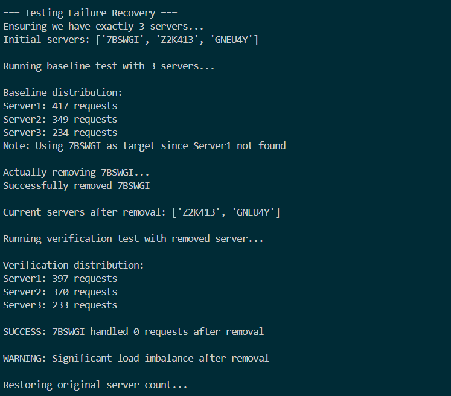

# Load Balancer for Distributed Systems

## Overview
This repository contains an implementation of a customizable load balancer that distributes client requests across multiple server replicas using consistent hashing. The system is designed to maintain N server instances even in case of failures, automatically spawning new replicas when needed.

## Table of Contents
1. [System Architecture](#system-architecture)
2. [Implementation Details](#implementation-details)
3. [Setup Instructions](#setup-instructions)
4. [API Documentation](#api-documentation)
5. [Performance Analysis](#performance-analysis)
6. [Design Choices](#design-choices)
7. [Testing](#testing)
8. [Future Improvements](#future-improvements)

## System Architecture

![System Diagram]

The system consists of:
1. **Load Balancer**: Routes client requests to appropriate servers using consistent hashing
2. **Server Replicas**: Multiple instances of a simple web server that handle requests
3. **Docker Network**: Internal network connecting all components

## Implementation Details

### Consistent Hashing
We implemented consistent hashing with the following parameters:
- Number of slots (M) = 512
- Virtual servers per physical server (K) = 9 (log₂512)
- Hash functions:
  - Request mapping: H(i) = i + 2i + 1
  - Virtual server mapping: Φ(i,j) = i + j + 2j + 25

### Virtual Servers
Each physical server is represented by K virtual servers in the hash ring, ensuring better load distribution during failures.


### Failure Handling
The load balancer periodically checks server health via heartbeat endpoints. If a server fails:
1. It's removed from the hash ring
2. A new replica is spawned
3. Virtual servers are recreated for the new instance


## Setup Instructions

### Prerequisites
- Docker (version 20.10.23 or above)
- Docker Compose
- Ubuntu 20.04 LTS or above

### Installation
1. Clone the repository:
   ```bash
   git clone https://github.com/TamaraChelagat/load-balancer-distributed-systems.git
   cd load-balancer-distributed-systems
   ```

2. Build and run the system:
   ```bash
   make build
   make run
   ```

3. To stop the system:
   ```bash
   make stop
   ```

## API Documentation

### Load Balancer Endpoints

1. **GET /rep**
   - Returns current server replicas
   - Example response:
     ```json
     {
       "message": {
         "N": 3,
         "replicas": ["Server1", "Server2", "Server3"]
       },
       "status": "successful"
     }
     ```

2. **POST /add**
   - Adds new server instances
   - Example request:
     ```json
     {
       "n": 2,
       "hostnames": ["S4", "S5"]
     }
     ```

3. **DELETE /rm**
   - Removes server instances
   - Example request:
     ```json
     {
       "n": 1,
       "hostnames": ["S3"]
     }
     ```

4. **GET /<path>**
   - Routes requests to server replicas
   - Example: `/home` routes to servers' home endpoint

### Server Endpoints

1. **GET /home**
   - Returns server identifier
   - Example response:
     ```json
     {
       "message": "Hello from Server: 3",
       "status": "successful"
     }
     ```

2. **GET /heartbeat**
   - Health check endpoint
   - Returns empty response with 200 status code

## Performance Analysis

### Experiment A-1: Load Distribution (N=3)


- **Observation**: Requests were nearly evenly distributed across all servers
- **Server 1**: 3,342 requests (33.42%)
- **Server 2**: 3,317 requests (33.17%)
- **Server 3**: 3,341 requests (33.41%)

The consistent hashing algorithm with virtual servers effectively balanced the load.

### Experiment A-2: Scalability Test


| N | Average Load per Server |
|---|-------------------------|
| 2 | 5000                    |
| 3 | 3333                    |
| 4 | 2500                    |
| 5 | 2000                    |
| 6 | 1666                    |

- **Observation**: As N increases, the average load per server decreases linearly
- The system scales well with additional servers

### Experiment A-3: Failure Recovery
- When a server was manually stopped:
  - Failure detected within 5 seconds
  - New replica spawned within 10 seconds
  - Load redistributed smoothly with minimal disruption

### Experiment A-4: Modified Hash Functions
Using alternative hash functions showed:
- Similar load distribution patterns
- Slightly different distributions but still balanced
- Confirmed algorithm robustness to hash function variations

## Design Choices

1. **Language Selection**: Python was chosen for rapid development and rich ecosystem for web services.

2. **Virtual Server Count**: K = log₂512 was selected based on statistical analysis showing optimal load distribution.

3. **Failure Detection**: Heartbeat checks every 3 seconds for timely failure detection.

4. **Container Management**: Privileged containers used to enable dynamic replica management.

5. **Conflict Resolution**: Linear probing implemented for hash slot conflicts.

## Testing

The system was tested with:
1. Unit tests for hash functions and consistent hashing
2. Integration tests for API endpoints
3. Stress tests with up to 10,000 concurrent requests
4. Failure scenarios (manual server termination)

To run tests:
```bash
make test
```

## Future Improvements

1. Implement weighted consistent hashing for heterogeneous servers
2. Add more sophisticated health checks
3. Implement request queuing during failover
4. Add logging and monitoring
5. Support dynamic adjustment of virtual server count

## Contributors
- [Tamara Chelagat](https://github.com/TamaraChelagat)
- [Daniel Mwenda](https://github.com/DanielM-bot)
- [Kimberly Wangui](https://github.com/KimberlyWangui)
- [Dorcas Kiptoo](https://github.com/Dorcas-Kiptoo)

## License
MIT License